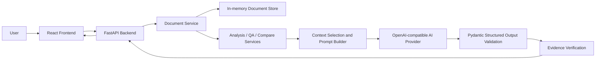

# Vericla — Legal Intelligence

Vericla is a Web Technology microproject for exploring legal and other structured documents with AI-assisted analysis. Users can upload a PDF or TXT file, review clauses and obligations, ask questions grounded in supplied text, inspect available evidence, and compare two documents. Vericla supports document understanding; it does not replace qualified legal advice.

## Problem Statement

Legal and contractual documents can be lengthy, dense, and difficult to navigate. Important details such as payment terms, notice periods, obligations, and dates may be spread across multiple sections. Readers need a clearer way to locate relevant information and trace summaries back to the source document.

## Objective

Vericla aims to make document review more accessible by providing:

- Document analysis with key clauses, obligations, dates, and review signals.
- Evidence-grounded questions and answers based on supplied document text.
- Document comparison that highlights supported changes.
- Actionable review information based on extracted dates, signals, and follow-up questions.

Vericla provides AI-assisted information. It does not replace advice from a qualified legal professional, and its output should be checked against the original document.

## Key Features

1. **Document Upload & Processing** — Upload PDF or TXT files for text extraction, normalization, and chunking.
2. **AI-Powered Document Analysis** — Generate a summary and identify document type, parties, clauses, obligations, dates, review signals, and questions.
3. **Clause Explorer** — Search identified clauses, inspect their details, and open supporting evidence where available.
4. **Evidence Inspector** — Review source excerpts and available page, section, chunk, and offset references.
5. **Ask Vericla** — Ask questions about a selected document and review the answer, uncertainty, and evidence references.
6. **Document Comparison** — Compare two session documents and inspect supported additions, removals, and modifications.
7. **Action Center** — Organize review signals, dates, and follow-up questions surfaced by analysis.
8. **Session History** — Return to documents available in the current in-memory session.
9. **Help & Safety** — Review evidence behavior, AI limitations, privacy behavior, and the not-legal-advice notice.

## Technology Stack

**Frontend**
- React
- TypeScript
- Vite
- Custom CSS design system. Tailwind CSS is not currently configured in this repository.

**Backend**
- Python
- FastAPI
- Pydantic and pydantic-settings

**AI**
- OpenAI-compatible Chat Completions provider
- Structured JSON-schema outputs
- Provider-output validation and evidence verification/grounding

**Document processing**
- PDF and TXT
- PDF text extraction with `pypdf`

**Testing and checks**
- Pytest
- TypeScript compiler
- ESLint
- Vite production build

## System Architecture

The frontend sends document, analysis, Q&A, and comparison requests to the FastAPI API. The document service extracts and normalizes text, divides it into chunks, and stores it for the current session. Analysis, Q&A, and comparison services select relevant context, build prompts, call the configured provider, validate structured output, and verify evidence before returning results.



The `fake` provider is intended for deterministic tests and local development; it is not genuine document analysis.

## How It Works

1. Upload a supported document.
2. Select an analysis context where applicable.
3. The document service extracts text, normalizes it, and divides it into chunks.
4. The relevant service selects document context and builds a prompt.
5. The configured AI provider returns structured output.
6. Pydantic validates the output, and evidence references are checked against source text and chunks.
7. Explore clauses and inspect available evidence in the workspace.
8. Ask questions grounded in the selected document.
9. Compare two documents in the current session.
10. Review dates, signals, and follow-up questions in the Action Center.

## Project Structure

```text
frontend/                 React, TypeScript, and Vite application
  src/components/         Workspace and shared UI components
  src/layouts/            Application shell
  src/pages/               Public site and workspace views
  src/services/            Frontend API clients
  .env.example             Frontend backend-proxy setting
backend/                  FastAPI application
  app/api/v1/endpoints/    Health, documents, analysis, Q&A, and compare routes
  app/schemas/             Request and response models
  app/services/            Provider, document, analysis, Q&A, compare, and evidence logic
  tests/                   Pytest suite
docs/                     AI provider configuration notes
examples/                 Currently empty
tests/                    Currently empty at repository root
```

## Installation & Setup

Use two terminals from the repository root.

**Backend (Windows PowerShell)**

```powershell
cd backend
python -m venv .venv
.\.venv\Scripts\activate
pip install -r requirements.txt
```

The backend reads `backend/.env` using the `VERICLA_` prefix. This repository currently does not include a backend `.env.example`; create `backend/.env` with the settings you need. For a real provider, configure:

```dotenv
VERICLA_AI_PROVIDER=openai
VERICLA_AI_API_KEY=replace-with-your-provider-key
VERICLA_AI_BASE_URL=https://api.openai.com/v1
VERICLA_AI_MODEL=gpt-4o-mini
VERICLA_AI_TIMEOUT_SECONDS=30
```

Never put a real API key in this README, frontend variables, or browser code. Keep the key in the backend environment. `VERICLA_AI_PROVIDER=fake` is available for tests and deterministic local development only.

**Frontend (Windows PowerShell)**

```powershell
cd frontend
Copy-Item .env.example .env
npm install
```

The existing `frontend/.env.example` sets `VERICLA_BACKEND_URL=http://127.0.0.1:8000` for the Vite `/api` development proxy. It can be changed when the backend runs elsewhere.

## Running the Project

Start the backend in one terminal:

```powershell
cd backend
.\.venv\Scripts\python.exe -m uvicorn app.main:app --reload
```

Start the frontend in a second terminal:

```powershell
cd frontend
npm run dev
```

With the default configuration, the backend is available at `http://127.0.0.1:8000` and Vite serves the frontend at `http://localhost:5173` (or `http://127.0.0.1:5173`). The frontend proxies `/api` requests to the backend.

## Safety & Privacy

- AI-generated information may be incomplete or incorrect.
- Vericla is not a substitute for professional legal advice.
- Evidence is shown where available; verify important statements against the original document.
- Uploaded documents and results are held in ephemeral in-memory session storage and expire after the configured session lifetime (one hour by default). They are not persistent history.
- Do not upload sensitive material to a deployment you do not trust. Review the data-handling terms of any configured AI provider.
- Provider API credentials are read by the backend and are not sent to the frontend.

## Testing

Known verified project results:

- Backend suite: 61 passed.
- Provider tests: passed.
- Focused Compare tests: 8 passed, including grounded value changes and evidence checks.
- Frontend TypeScript check: passed.
- ESLint: passed.
- Vite production build: passed.

Run the checks from their respective directories:

```powershell
# Backend
cd backend
.\.venv\Scripts\python.exe -m pytest

# Frontend
cd ..\frontend
npm run typecheck
npm run lint
npm run build
```

## Screens / Product Flow

- **Public landing page** — Explains Vericla, its workflow, evidence approach, and safety limitations.
- **Document workspace** — Upload files, choose a perspective, and return to current session documents.
- **Analysis** — Review the summary, key terms, obligations, dates, and signals.
- **Clause Explorer** — Search and inspect extracted clauses.
- **Evidence Inspector** — Review verified source excerpts and references.
- **Ask Vericla** — Ask document-grounded questions.
- **Compare** — Review supported changes between two session documents.
- **Action Center** — Review extracted dates, signals, and questions.
- **History** — Browse documents held in the current session.
- **Help & Safety** — Read the product’s evidence, privacy, and limitation information.

## Limitations

- Document and analysis data is stored in memory for the current session, not a persistent database.
- The current supported upload formats are PDF and TXT.
- AI output still requires review and may be incomplete or incorrect.
- Evidence grounding is conservative and based on source text; unsupported statements may be omitted.
- A real deployment requires secure server-side AI provider configuration and appropriate data-handling controls.

## Future Scope

Potential future improvements include persistent database storage, authentication, support for richer document formats, semantic retrieval, improved evidence ranking, organization/team workspaces, exportable reports, and deployment infrastructure. These are not currently represented as existing features.

## Conclusion

Vericla combines web technologies with AI-assisted document intelligence to help users navigate documents, inspect source evidence, ask focused questions, and compare terms. Its structured outputs and evidence checks support clearer review while keeping professional legal judgment in control.

## License

No license file or license declaration is currently present in the repository.
